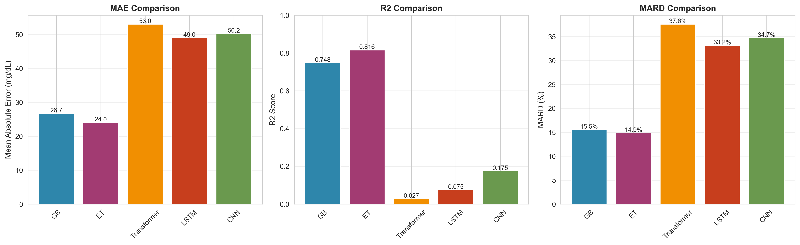
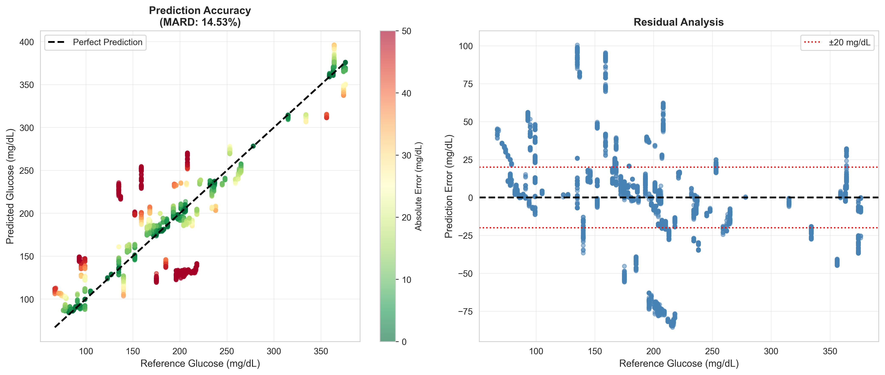
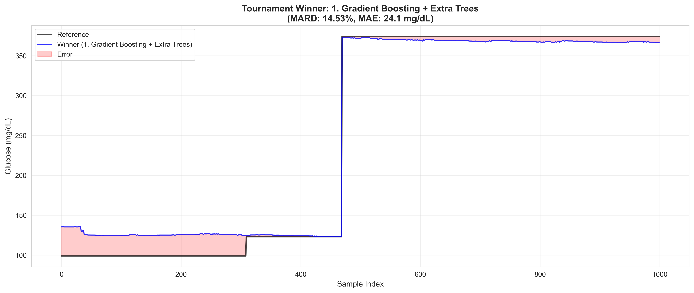

# Non-Invasive Continuous Glucose Monitoring Model

**GlucoVista Research Collaboration | DS340W Team 7**

A drift-robust machine learning pipeline for predicting blood glucose levels from multimodal non-invasive sensor data. This project demonstrates that tree-based ensembles operating on carefully engineered features outperform deep learning models under sensor drift conditions.

---

## Key Results

| Metric                            | Value      |
| --------------------------------- | ---------- |
| Mean Absolute Error               | 24.1 mg/dL |
| Mean Absolute Relative Difference | 14.53%     |
| R² Score                         | 0.80       |
| Clinical Safe Zone (A+B)          | 85.5%      |

---

## Table of Contents

1. [Results and Visualizations](https://claude.ai/chat/db6aa3e1-e44f-47eb-a5a4-8a1021d355ce#results-and-visualizations)
2. [Methodology Overview](https://claude.ai/chat/db6aa3e1-e44f-47eb-a5a4-8a1021d355ce#methodology-overview)
3. [Installation and Usage](https://claude.ai/chat/db6aa3e1-e44f-47eb-a5a4-8a1021d355ce#installation-and-usage)
4. [Data Privacy](https://claude.ai/chat/db6aa3e1-e44f-47eb-a5a4-8a1021d355ce#data-privacy)
5. [Limitations and Future Work](https://claude.ai/chat/db6aa3e1-e44f-47eb-a5a4-8a1021d355ce#limitations-and-future-work)

---

## Results and Visualizations

### Model Comparison

Tree-based models significantly outperformed deep learning architectures which failed to generalize under sensor drift.



*Left panel shows MAE where tree models achieve approximately 25 mg/dL error versus 50 mg/dL for deep learning. Center panel shows R² where tree models achieve 0.75-0.82 versus near-zero for deep learning. Right panel shows MARD where tree models achieve 15% versus 33-38% for deep learning.*

### Quantitative Results

| Model                      | MAE (mg/dL)    | R² Score       | MARD (%)        |
| -------------------------- | -------------- | --------------- | --------------- |
| Gradient Boosting          | 26.7           | 0.748           | 15.5            |
| Extra Trees                | 24.0           | 0.816           | 14.9            |
| Transformer                | 53.0           | 0.027           | 37.6            |
| LSTM                       | 49.0           | 0.075           | 33.2            |
| CNN                        | 50.2           | 0.175           | 34.7            |
| **GB + ET Ensemble** | **24.1** | **0.800** | **14.53** |

### Prediction Accuracy



*Left panel shows predicted versus reference glucose with color indicating error magnitude. Right panel shows residual analysis with most errors within the ±20 mg/dL clinical threshold.*

### Time Series Tracking



*The ensemble tracks a major glycemic transition from 125 mg/dL to 375 mg/dL. The shaded region shows prediction error remaining small throughout.*

### Ensemble Tournament

| Ensemble Combination       | MAE (mg/dL)     | R²             | MARD (%)        |
| -------------------------- | --------------- | --------------- | --------------- |
| **GB + Extra Trees** | **24.14** | **0.800** | **14.53** |
| GB + ET + Transformer      | 32.60           | 0.664           | 21.65           |
| ET + CNN + GB              | 32.07           | 0.692           | 20.89           |
| GB + LSTM + Transformer    | 40.83           | 0.443           | 27.68           |
| LSTM + Transformer + CNN   | 49.28           | 0.160           | 34.41           |

Adding deep learning components consistently degraded performance.

---

## Methodology Overview

For detailed methodology, theoretical framework, and model justification, see the full report.

### The Problem

Non-invasive glucose sensors exhibit baseline drift over time. Deep learning models memorize these drifting baselines and fail on new data.

### Our Solution

1. **Drift-Resistant Features:** We engineered 134 features describing relative change (gradients, rolling normalization) rather than absolute values.
2. **Time-Chunk Validation:** Data split into 1-hour chunks assigned to train/test sets, preventing temporal leakage.

### Final Model

An equally-weighted ensemble of Gradient Boosting and Extra Trees (0.5 GB + 0.5 ET) operating on drift-resistant tabular features.

---

## Installation and Usage

### Requirements

```
pip install -r requirements.txt
```

### Initial Setup

```bash
git clone https://github.com/your-username/glucovista-ml.git
cd glucovista-ml
pip install -r requirements.txt
```

### Data Setup

```
.
├── Sensor Data 1_2/
│   └── gmData-*.csv
├── Sensor Data 2_2/
│   └── gmData-*.csv
└── Glucose Data/
    └── libra-*.csv
```

### Run

```bash
python model.py
```

Generates `model_comparison.png`, `clarke_grid.png`, and `tournament_winner.png`.

### Feature Analysis

```bash
jupyter notebook feature_analysis_dashboard.ipynb
```

---

## Data Privacy

The sensor and glucose data files are **not included** in this repository. The dataset contains protected health information from GlucoVista subject to HIPAA regulations and confidentiality agreements. Contact the research team for data access inquiries.

---

## File Structure

```
glucovista-ml/
├── README.md
├── requirements.txt
├── model.py                          # Training and evaluation pipeline
├── feature_engineering.py            # Feature creation functions
├── feature_analysis_dashboard.ipynb  # Visualization notebook
├── Sensor Data 1_2/                  # (not in repo)
├── Sensor Data 2_2/                  # (not in repo)
└── Glucose Data/                     # (not in repo)
```

---

## Limitations and Future Work

### Limitations

* Single 80/20 split rather than k-fold cross-validation
* 14.53% MARD exceeds the 10% ISO 15197 clinical threshold
* Limited sensor sessions in the dataset
* Deep learning models received less hyperparameter tuning

### Future Work

* 5-fold grouped cross-validation with confidence intervals
* Transfer learning for user personalization
* Model quantization for edge deployment
* Conformal prediction for uncertainty quantification

---

## Acknowledgments

This work was conducted as part of DS340W at Virginia Tech in collaboration with GlucoVista.

---

**Last Updated.** December 2025
